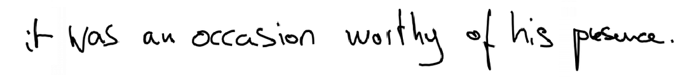
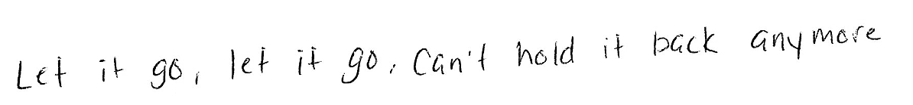

# OCR_Metrics
# 
# Ocr for detecting textin images

### Description

_Purpose_: Detecting text present in the image; 

_Input_: Normal image containing Text.

_Output_: Valid Text info

_Sample inputs:

| |  | |
